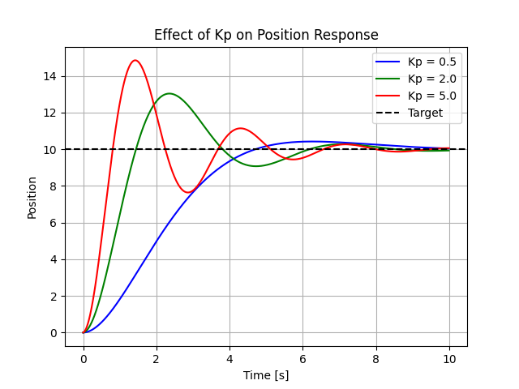

# notebook-of-ME
# 👋 Hi, I'm Phisit

I'm **Phisit**, a Robotics & Space Engineering student at **KMUTT (FIBO)**.  
I’m passionate about **space technology, robotics, and embedded systems**, and I enjoy building engineering projects that connect theory with real-world applications.

### 🔧 Interests
- 🚀 Space systems & aerospace technology  
- 🤖 Robotics, rovers, and autonomous systems  
- 📡 Embedded systems & electronics  
- 🌍 Engineering solutions for future cities  

### 🛠 Tools & Skills
- Languages: C / C++ / Python  
- Platforms: Arduino, ESP32, Raspberry Pi  
- Engineering: Statics, structural analysis, system thinking  

### 🌱 Currently learning
- Orbital mechanics & space mission concepts  
- Advanced electronics and system integration  
- Professional English for engineering communication  

---

## 🎯 Repository Goal

This repository is a personal learning notebook focused on **Guidance, Navigation, and Control (GNC)**  
for aerospace and space systems.

The goal is to build strong fundamentals in:
- Motion modeling & dynamics
- State estimation and sensor fusion
- Guidance logic and control design
- Simulation-driven engineering thinking

## PID Gain Comparison (Simulation)

The following result shows the effect of different **Kp values**
on a 1D point-mass position control system.

